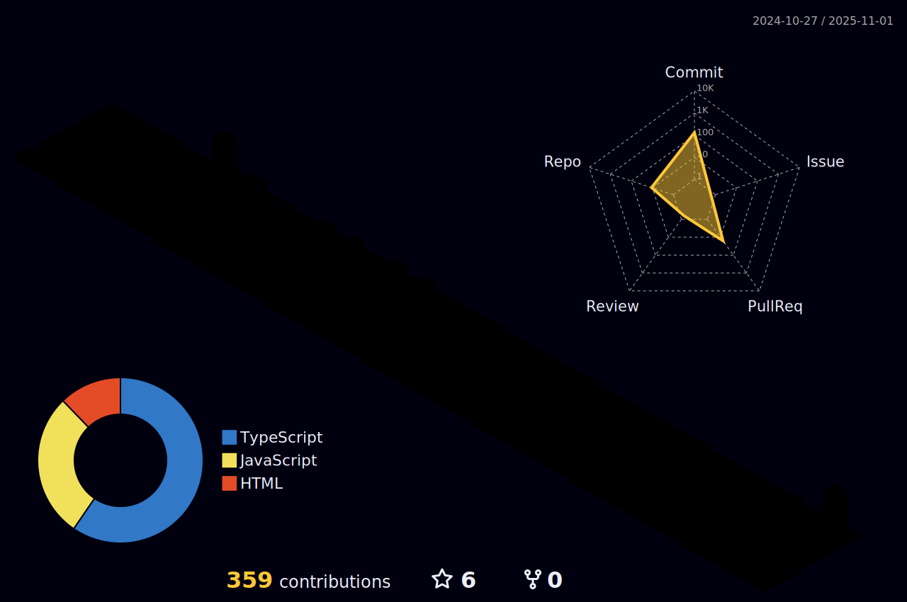

<h1 align="center">Hi 👋, I'm Abhishek Yadav</h1>
<h3 align="center">A passionate Full Stack Web Developer</h3>

- 🌱 I’m currently learning **Redux**

- 👨‍💻 All of my projects are available at [https://abhishekyadav001.github.io/](https://abhishekyadav001.github.io/)

- 👀 Looking for contribution in ReactJS Project

- 💬 Ask me about **MERN stack**

- 📫 How to reach me **abhishekyadav2723@gmail.com**

- 🎧 I love to listen Music & Travelling

## Connect with me:

  

## Languages and Tools:

  
  
   
  
  
  
  
  
  

 

## My Github Stats:

     

